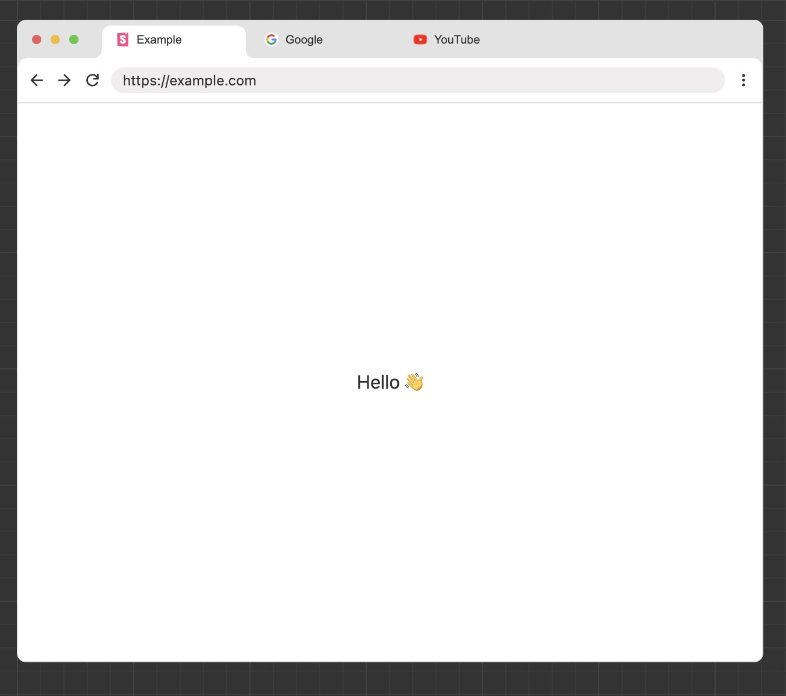
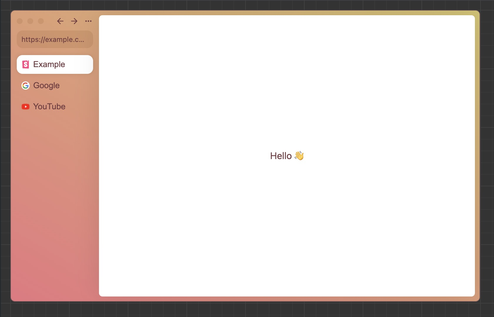

# 🪟 react-browser-containers ✨

Customizable browser-like containers, with tabs functionality (React).

```bash
npm i @enhanced-jax/react-browser-containers
```


|  ChromeBrowser |  ArcBrowser |
| :------------------------------------: | :------------------------------: |
|                |             |

You can use the components to demonstrate functionality with browsers, or as decorative elements in your project. The components are not designed to be used as actual browsers.

## Basic Usage

```jsx
import { BrowserContainer } from "@enhanced-jax/react-browser-containers";
import { useState } from "react";

const App = () => {
  const [tab, setTab] = useState(0);
  const tabs = [
    {
      name: "Google",
      link: "https://google.com",
      content: <div>Content</div>,
      icon: (
        
      ),
    },
  ];

  return <ChromeBrowser tab={tab} setTab={setTab} tabs={tabs}></ChromeBrowser>;
};
```

### Props

| Name           | Type                                                                                 | Description                                                                                                      |
| -------------- | ------------------------------------------------------------------------------------ | ---------------------------------------------------------------------------------------------------------------- |
| theme          | `"light" \| "dark"`                                                                  | Theme of the browser, default is light. The light and dark theme of ArcBrowser is the same.                      |
| tabs           | `Array<{name: string;link: string;content: React.ReactNode;icon: React.ReactNode;}>` | Pages in the browser.                                                                                            |
| shadow         | `boolean`                                                                            | Shadow of the browser, default is true.                                                                          |
| useContentSize | `boolean`                                                                            | Default is false: browser will be the size of its parent element. True: browser will be the size of its content. |
| contentScroll  | `boolean`                                                                            | If content inside the container should be scrollable, default is true.                                           |
| leftIcons      | `React.ReactNode`                                                                    | Leave empty for default icons.                                                                                   |
| rightIcons     | `React.ReactNode`                                                                    | Leave empty for default icons.                                                                                   |
| lightTheme     | `Theme`                                                                              | Changes the light theme of the browser.                                                                          |
| darkTheme      | `Theme`                                                                              | Changes the dark theme of the browser.                                                                           |
| children       | `React.ReactNode`                                                                    | Content displayed over all pages.                                                                                |
| tab            | `number`                                                                             | Active tab index.                                                                                                |
| setTab         | `(tab: number) => void`                                                              | Function to set the active tab index.                                                                            |

```js
export default interface Theme {
  theme: string;
  bg: string;
  contentBg: string;
  text: string;
  border: string;
  searchBarBg: string;
  tabBarBg: string;
  tabDivider: string;
  tabHoverBg: string;
  tabSelectedBg: string;
}
```

## Development

To get started:

```bash
git clone https://github.com/EnhancedJax/react-browser-containers.git
cd react-browser-containers
npm i
```

Actions:

```bash
npm run storybook # start storybook
npm run build # build the library
npm run test # test the library
```

### Testing in another project

```bash
npm run build
npm link
npm link "../your-project/node_modules/react"
cd ../your-project
npm link @enhanced-jax/react-browser-containers
```
